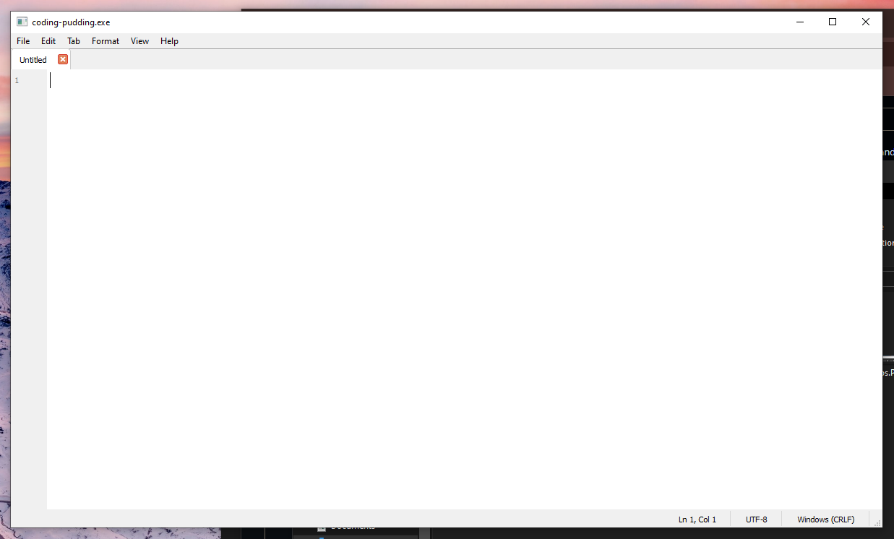
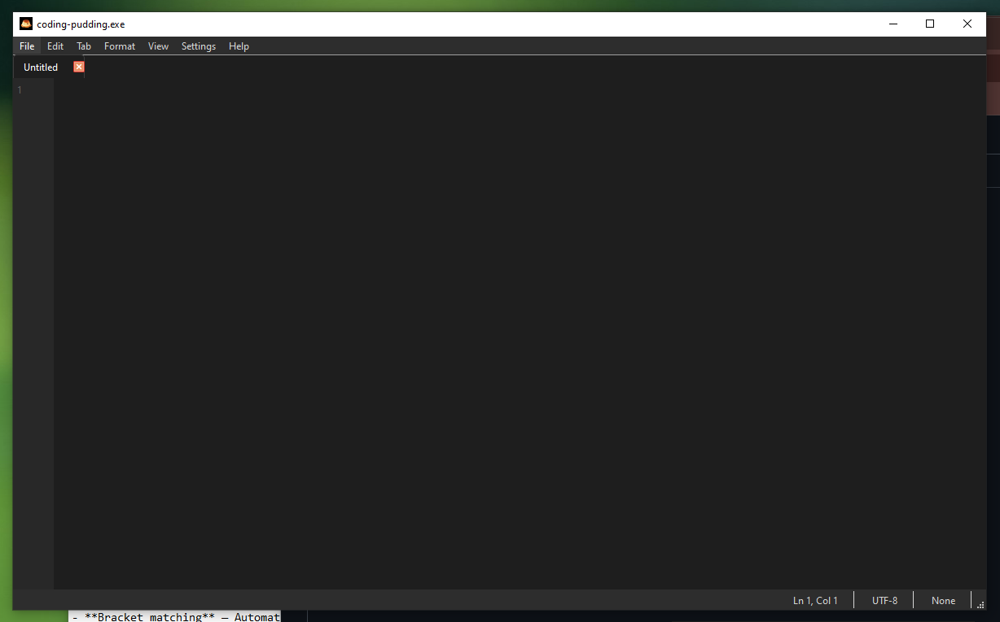
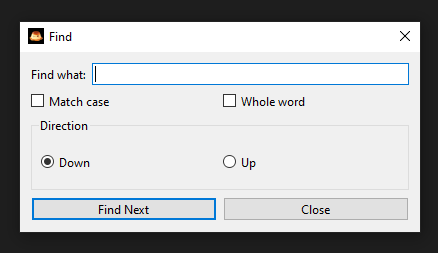
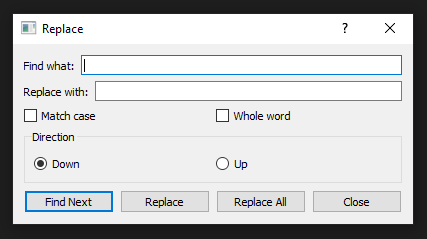
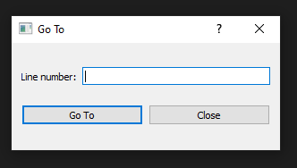
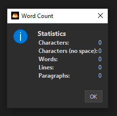
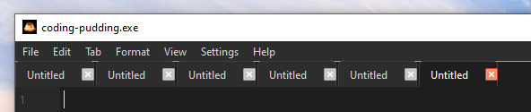
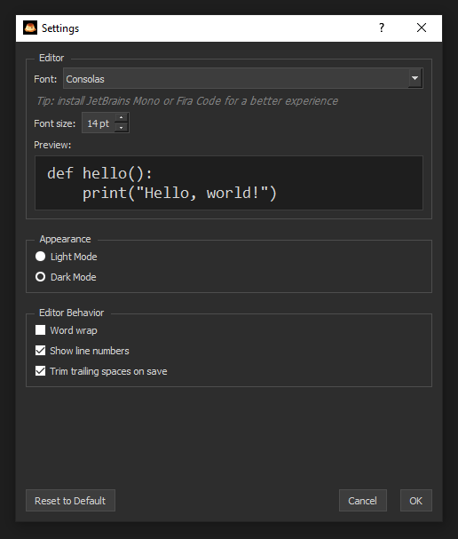
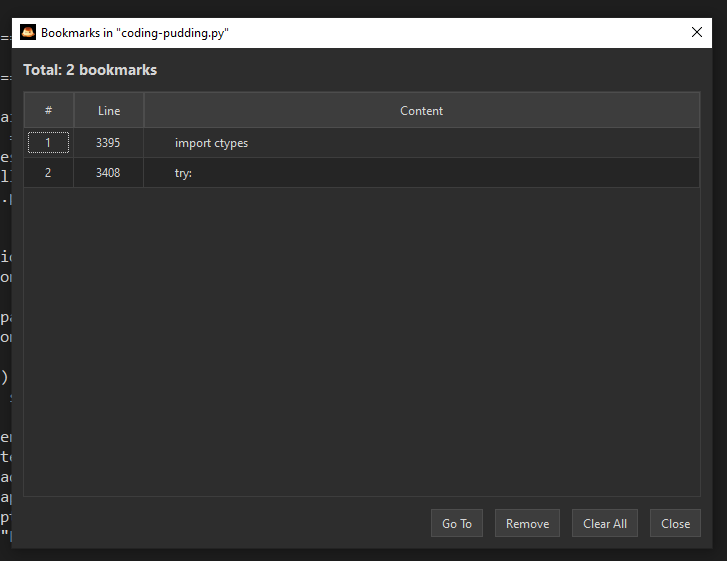
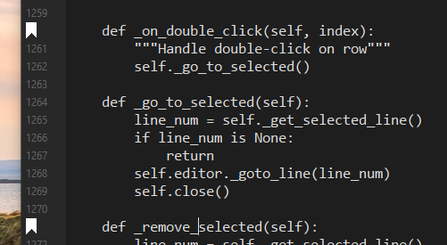

# coding-pudding.exe

> An optimized Python editor for low-configuration laptops/PCs.

<p align="center">
  
  
</p>

<p align="center">
  
  
</p>

<p align="center">
  
  
</p>

<p align="center">
  
  
</p>


<p align="center">
  
  
</p>

---

## Features

- **Tabs** — Open multiple files in one window.
- **Dark mode** — Protect your eyes during long coding sessions.
- **Automatic indentation** — Automatically indent after `:` (no more typing 4 spaces manually).
- **Bracket matching** — Automatically close opening brackets `()`, `[]`, `{}`, `<>`, `""`, `''`.
- **Smart bracket deletion** — Delete matching bracket pairs intelligently.
- **Tear-off tabs** — Drag a tab out to create a new window with that file.
- **Auto-scroll** — Middle-click to create an anchor and scroll automatically.
- **Toggle comment** — `Ctrl + /` to comment/uncomment selected lines.
- **Line numbers** — Easily locate your code by line number.
- **Find/Replace/Go To** — Full search, replace, and navigation support.
- **Automatically saving settings** — Remembers your theme (dark/light) and window size.
- **"Open with coding-pudding"** — Right-click any file to open it directly.
- **Word counting** - Press `Ctrl + Shift + W` at the same time to open `Word Count` dialog.
- **Horizontal scrolling** - Press `Shift + Scroll` to do horizontal scroll.
- **Settings dialog** - Press `Ctrl + ,` to configure font, font size, theme, and editor behavior.
- **Remember opened tabs** - The editor remembers tabs that belong to the last coding session.
- **Tab context manager** - Right-click on tabs card now can open a menu.
- **Close all tabs** - Press `Ctrl + Alt + W` to close all tabs (if there are unsaved files, it will show a `Warning` dialog).
- **Indentation size setting** - Change many sizes of indentation inside `Settings` dialog.

---

## Installation

### Option 1: Download coding-pudding.exe (Recommended)

1. Download `coding-pudding.exe` from [**Releases**](../../releases).
2. Run the file (no Python installation required).
3. Right-click any file --> **"Open with coding-pudding"**.

### Option 2: Run from source code (coding-pudding.py)

```bash
# Clone repository
git clone https://github.com/caoductri698/coding-pudding.git
cd coding-pudding

# Install dependencies
py -m pip install PyQt6

# Run app
py coding-pudding.py
```

### Option 3: Build coding-pudding.exe by yourself

```bash
# Clone repository
git clone https://github.com/caoductri698/coding-pudding.git

# Install PyInstaller
py -m pip install pyinstaller

# Build
py -m PyInstaller --onefile --windowed --icon=icon.ico --add-data="icon.ico;." --name coding-pudding coding-pudding.py

# File .exe is ready in dist/coding-pudding.exe
```

---

## Requirements

- **Operating System**: Windows 7/8/10/11
- **RAM**: at least 2GB (for best performance)
- **Python version** (if running from source code): 3.8+ (tested on 3.14)

---

## Keyboard Shortcuts

| Shortcut | Action |
| :--- | :--- |
| `Ctrl + N` | New file |
| `Ctrl + T` | New tab |
| `Ctrl + O` | Open file |
| `Ctrl + S` | Save |
| `Ctrl + Shift + S` | Save as |
| `Ctrl + W` | Close tab |
| `Ctrl + Q` | Exit |
| `Ctrl + Z` | Undo |
| `Ctrl + Y` | Redo |
| `Ctrl + F` | Find |
| `Ctrl + H` | Replace |
| `Ctrl + G` | Go To |
| `Ctrl + /` | Toggle comment |
| `Ctrl + Tab` | Next tab |
| `Ctrl + Shift + Tab` | Previous tab |
| `F5` or `Fn + F5` | Time/Date |
| `Tab` | 1 indentation (line start)/4 spaces |
| `Shift + Tab` | Unindent |
| `Ctrl + Shift + W` | Word count |
| `Shift + Scroll` | Horizontal scrolling |
| `Ctrl + ,` | Settings dialog |
| `Ctrl + Alt + W` | Close all tabs |
| `Ctrl + Scroll` | Zoom in out out |

---

## How to use

### Open a file

- **Option 1**: `Ctrl + O` --> Choose file
- **Option 2**: Right-click file --> **"Open with coding-pudding"**
- **Option 3**: Drag file into the app window

### Tear-off tab

- Click and hold a tab
- Drag it outside the tab bar
--> A new window appears with that file

### Automatically scrolling

- Middle-click anywhere in the editor --> An anchor appears
- Move mouse up/down --> The page scrolls automatically
- The further from the anchor, the faster it scrolls
- Middle-click again to disable the anchor

### Register context menu

- **Automatically**: Run the app once --> it registers automatically
- **Manually**: Help --> Register 'Open with' Menu
- **Removing**: Help --> Unregister 'Open with' Menu

---

## Built with

- **Python 3.14** — Programming language
- **PyQt6** — GUI framework
- **PyInstaller** — Packaging tool
- **winreg** — Windows Registry integration

---

## Contributing

Contributions are welcome!

1. Fork the repository
2. Create a new branch (`git checkout -b feature/AmazingFeature`)
3. Commit your changes (`git commit -m 'Add some AmazingFeature'`)
4. Push to the branch (`git push origin feature/AmazingFeature`)
5. Open a Pull Request (PR)

---

## Bug reports

If you find a bug, please create an [Issue](../../issues) with:
- Description of the bug
- Steps to reproduce
- Screenshots (if possible)
- Windows version

---

## Contact

- **GitHub**: [@caoductri698](https://github.com/caoductri698)
- **Gmail**: caoductri698@gmail.com
- **TikTok**: [tdwc208](https://tiktok.com/@tdwc208)
- **Instagram**: [tdwc208](https://instagram.com/tdwc208)
- **Hotline**: +84342513045
- **Facebook**: [tri6462 (Trii Dwck)](https://facebook.com/tri6462)

---

## ⭐ If you find this application useful, please give me a star, that will be a lot to me!

[](https://github.com/caoductri698/coding-pudding)

---

## License

This project is licensed under the **GPL v3.0 License**

You are free to:
- Use commercially
- Modify
- Distribute
- Use privately

Under the following conditions:

- **Source code MUST be provided** with any distribution
- **Derivatives must also be licensed under GPL v3.0**
- **Original copyright notice must be preserved**

For more details, see the [LICENSE](LICENSE) file or visit [gnu.org/licenses/gpl-3.0](https://www.gnu.org/licenses/gpl-3.0.html).