# coding-pudding.exe

> An optimized Python editor for low-configuration laptops/PCs.

<p align="center">
  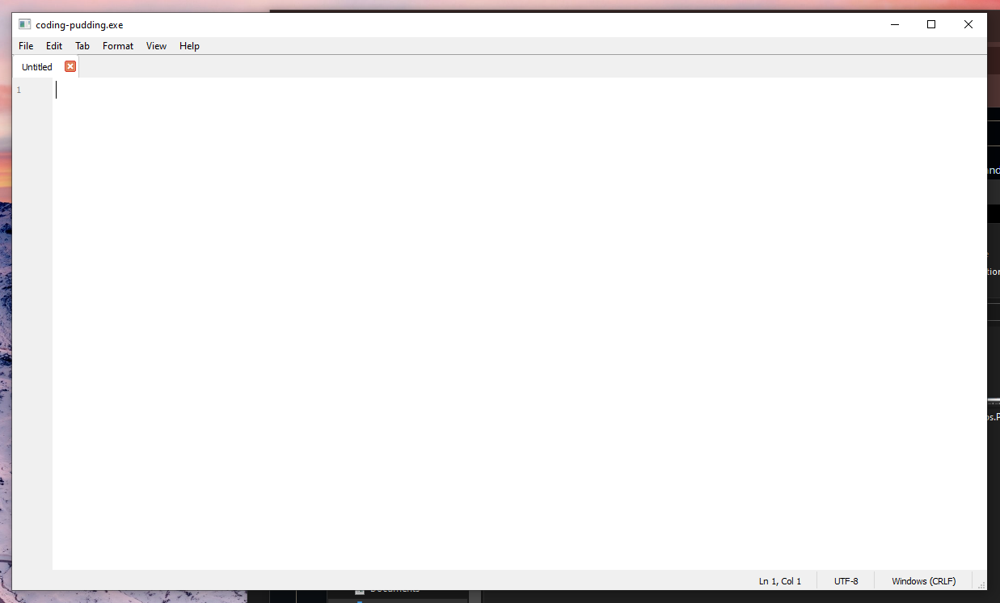
  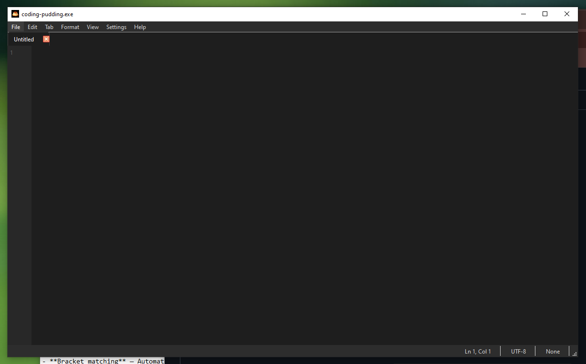
</p>

<p align="center">
  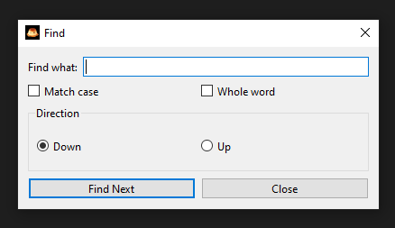
  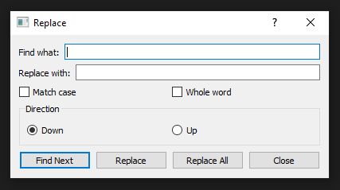
</p>

<p align="center">
  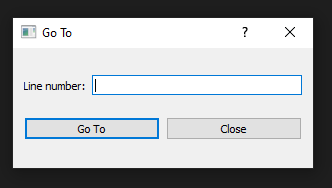
  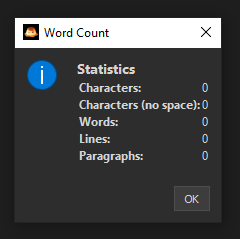
</p>

<p align="center">
  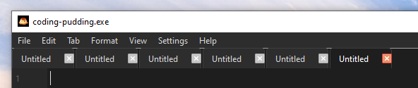
  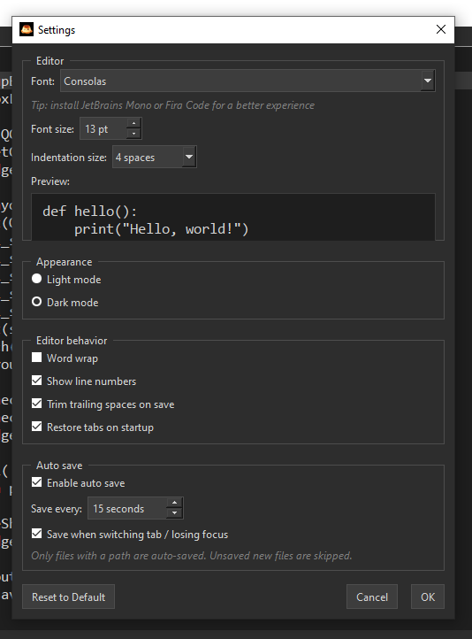
</p>

<p align="center">
  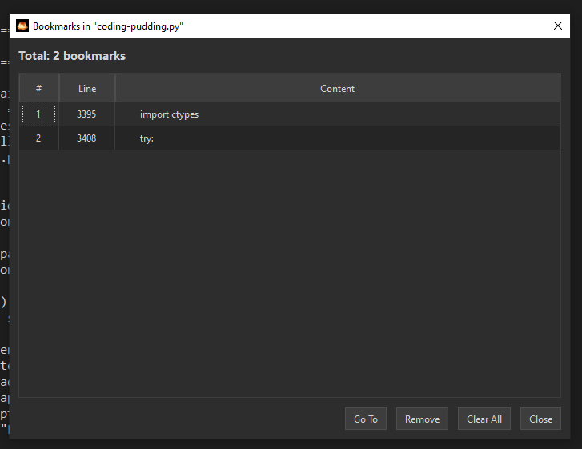
  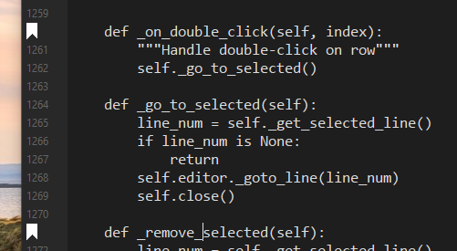
</p>

<p align="center">
  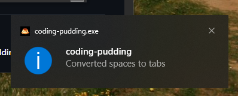
</p>

---

## Features

- **Tabs** - Open multiple files in one window.
- **Dark mode** - Protect your eyes during long coding sessions.
- **Automatic indentation** - Automatically indent after `:` (no more typing 4 spaces manually).
- **Bracket matching** - Automatically close opening brackets `()`, `[]`, `{}`, `<>`, `""`, `''`.
- **Smart bracket deletion** - Delete matching bracket pairs intelligently.
- **Tear-off tabs** - Drag a tab out to create a new window with that file.
- **Auto-scroll** - Middle-click to create an anchor and scroll automatically.
- **Toggle comment** - `Ctrl + /` to comment/uncomment selected lines.
- **Line numbers** - Easily locate your code by line number.
- **Find / Replace / Go To** - Full search, replace, and navigation support.
- **Auto-saving settings** - Remembers your theme (dark/light) and window size.
- **"Open with coding-pudding"** - Right-click any file to open it directly.
- **Word counting** - Press `Ctrl + Shift + W` to open the `Word Count` dialog.
- **Horizontal scrolling** - Press `Shift + Scroll` to do horizontal scroll.
- **Settings dialog** - Press `Ctrl + ,` to configure font, font size, theme, and editor behavior.
- **Remember opened tabs** - The editor remembers tabs from the last coding session.
- **Tab context menu** - Right-click a tab to open a context menu.
- **Close all tabs** - Press `Ctrl + Alt + W` to close all tabs (with unsaved-changes warning).
- **Indentation size setting** - Change indentation size in the `Settings` dialog.
- **Bookmarks** - Mark important parts of your project.
- **Open Recent files** - `File` --> `Open Recent` to show the 10 most recently opened files.
- **Desktop notifications** - Toast notifications appear at the bottom-right of the screen with the app icon and name. Works on Windows 7 / 8 / 10 / 11. Falls back to in-app toasts on non-Windows systems.
- **Tab elide** - Long file names are elided in the middle; tabs don't stretch to full width. Hover to see the full path.
- **Convert indentation** - Convert leading whitespace between tabs and spaces with `Format` --> `Convert Indentation`.
- **Auto save** - Automatically save modified files at a configurable interval (default: 15 seconds). Also saves when switching tabs or losing window focus. Enable in `Settings` --> `Auto Save`.
- **Pin favorite recent files** - Pin important files to the top of the `Open Recent` menu. Right-click a tab --> `Pin to Recent`.
- **Current line highlight** - The line containing the cursor is highlighted with a subtle background color (theme-aware).
- **Middle-click close tab** - Middle-click on any tab to close it. Press and release on the same tab to close; press on one tab and release on another to cancel.

---

## Installation

### Option 1: Download coding-pudding.exe (Recommended)

1. Download `coding-pudding.exe` from [**Releases**](../../releases).
2. Run the file (no Python installation required).
3. Right-click any file --> **"Open with coding-pudding"**.

### Option 2: Run from source code (coding-pudding.py)

```bash
# Clone repository
git clone https://github.com/caoductri698/coding-pudding.git
cd coding-pudding

# Install dependencies
py -m pip install PyQt6

# Run app
py coding-pudding.py
```

### Option 3: Build coding-pudding.exe by yourself

```bash
# Clone repository
git clone https://github.com/caoductri698/coding-pudding.git

# Install PyInstaller
py -m pip install pyinstaller

# Build
py -m PyInstaller --onefile --windowed --icon=icon.ico --add-data="icon.ico;." --name coding-pudding coding-pudding.py

# File .exe is ready in dist/coding-pudding.exe
```

---

## Requirements

- **Operating System**: Windows 7/8/10/11
- **RAM**: at least 2GB (for best performance)
- **Python version** (if running from source code): 3.8+ (tested on 3.14)

---

## Keyboard Shortcuts

| Shortcut | Action |
| :--- | :--- |
| `Ctrl + N` | New file |
| `Ctrl + T` | New tab |
| `Ctrl + O` | Open file |
| `Ctrl + S` | Save |
| `Ctrl + Shift + S` | Save as |
| `Ctrl + W` | Close tab |
| `Ctrl + Q` | Exit |
| `Ctrl + Z` | Undo |
| `Ctrl + Y` | Redo |
| `Ctrl + F` | Find |
| `Ctrl + H` | Replace |
| `Ctrl + G` | Go To |
| `Ctrl + /` | Toggle comment |
| `Ctrl + Tab` | Next tab |
| `Ctrl + Shift + Tab` | Previous tab |
| `F5` or `Fn + F5` | Time/Date |
| `Tab` | 1 indentation (line start)/4 spaces |
| `Shift + Tab` | Unindent |
| `Ctrl + Shift + W` | Word count |
| `Shift + Scroll` | Horizontal scrolling |
| `Ctrl + ,` | Settings dialog |
| `Ctrl + Alt + W` | Close all tabs |
| `Ctrl + Scroll` | Zoom in or out |
| `Ctrl + F2` or `Ctrl + Fn + F2` | Toggle bookmark at current line |
| `F2` or `Fn + F2` | Jump to the next bookmark |
| `Shift + F2` or `Shift + Fn + F2` | Jump to the previous bookmark |
| `Ctrl + Shift + B` | Open `Bookmarks` dialog |

---

## How to use

### Open a file

- **Option 1**: `Ctrl + O` --> Choose file
- **Option 2**: Right-click file --> **"Open with coding-pudding"**
- **Option 3**: Drag file into the app window

### Tear-off tab

- Click and hold a tab
- Drag it outside the tab bar
--> A new window appears with that file

### Automatically scrolling

- Middle-click anywhere in the editor --> An anchor appears
- Move mouse up/down --> The page scrolls automatically
- The further from the anchor, the faster it scrolls
- Middle-click again to disable the anchor

### Register context menu

- **Automatically**: Run the app once --> it registers automatically
- **Manually**: Help --> Register 'Open with' Menu
- **Removing**: Help --> Unregister 'Open with' Menu

### Indentation converting
This editor supports two style of indentation:
- **Spaces** (default: **FOUR** spaces) - recommended by `PEP 8`
- **Tabs** (`\t`) - smaller file size, width is configurable
To convert indentation:
1. Open a file (`Ctrl + O`)
2. Go to `Format` --> `Convert Indentation`
3. Choose `ONE` style:
- **Tabs to Spaces** - replace all leading tabs to spaces
- **Spaces to Tabs** - replace all leading spaces to tabs
The conversion only affects **leading whitespace** (indentation), not `spaces`/`tabs` **IN THE MIDDLE** of a line.

**Example:**

```python
Before (tabs):              After (tabs --> spaces):
def hello():                def hello():
\tprint("hi")                   print("hi")
\tif True:                       if True:
\t\tpass                            pass
```

**Notes:**
- If there is **NO** leading tabs or **NO** leading spaces, a status message will appear - no changes is made.
- Indentation size (2/4/8 spaces or tab character) can be configured in `Settings` dialog (`Ctrl + ,`) --> `Indentation size`.
- Changes mark the file as **MODIFIED**.

### Auto-save
- The **MODIFIED** file is automatically saved after **N** seconds - interval between auto saves (5 --> 600 seconds, default: 15 seconds).
- The file will be automatically saved when **switching tabs**/**losing focus**.
Only files with their path are able to use this feature. Unsaved new files (`Untitled`) are skipped.
Every time you type, a 2-secs debouncer is reset. Auto save fires 2 seconds after you stop modifying you file.

### Pin/Unpin recent files
You can **PIN**/**UNPIN** you favorite files by doing these steps:
1. Open a file (`Ctrl + O`)
2. **RIGHT-CLICK** on the tab --> **Pin to Recent**
3. The file is now appeared in a **PINNED** section at the top of `File` --> `Open Recent`
4. To **UNPIN**, you can **RIGHT-CLICK** on the tab --> `Unpin from Recent`
Pinned files will not be duplicated in the `Recent` list

### Close tab with middle-click
- **MIDDLE-CLICK** on a tab --> close the tab.
- **MIDDLE-CLICK** on the X button --> closes the tab.
- **MIDDLE-CLICK** + drag to another tab --> no tab is closed.

### Desktop notifications
The app shows **TOAST NOTIFICATION** at the bottom-right of the screen for events, such as:
- Saving files
- Reloading files
- Converting indentation (tabs <--> spaces)
- Auto-saving
- Pinning / unpinning recent files
- Copying file path / file name
On Windows 10/11, the system automatically converts the balloon tip into a modern toast notification.
App identity registration (for the correct app name + icon on the toast):
- Register: Help --> Register App Identity (Toast).
- Unregister: Help --> Unregister App Identity.

---

## Troubleshooting

### Toast notification not showing
If notifications **NO LONGER** appear after running `coding-pudding` multiple times:
1. Open **Task Manager** - `taskmgr` (`Ctrl + Shift + Esc`).
2. Find **Windows Explorer**.
3. Right-click --> `Restart`.

This clears stale tray icon state left behind by crashed sessions.

### Toast shows "`Python`" instead of "`coding-pudding`"
This only happens when running from source code (python.exe). The official coding-pudding.exe from **Releases** will fix this problem.

---

## Built with

- **Python 3.14** - Programming language
- **PyQt6** - GUI framework
- **PyInstaller** - Packaging tool
- **winreg** - Windows Registry integration

---

## Contributing

Contributions are welcome!

1. Fork the repository
2. Create a new branch (`git checkout -b feature/AmazingFeature`)
3. Commit your changes (`git commit -m 'Add some AmazingFeature'`)
4. Push to the branch (`git push origin feature/AmazingFeature`)
5. Open a Pull Request (PR)

---

## Bug reports

If you find a bug, please create an [Issue](../../issues) with:
- Description of the bug
- Steps to reproduce
- Screenshots (if possible)
- Windows version

---

## Contact

- **GitHub**: [@caoductri698](https://github.com/caoductri698)
- **Gmail**: caoductri698@gmail.com
- **TikTok**: [tdwc208](https://tiktok.com/@tdwc208)
- **Instagram**: [tdwc208](https://instagram.com/tdwc208)
- **Hotline**: +84342513045
- **Facebook**: [tri6462 (Trii Dwck)](https://facebook.com/tri6462)

---

## ⭐ If you find this application useful, please give me a star, that will be a lot to me!

[](https://github.com/caoductri698/coding-pudding)

---

## License

This project is licensed under the **GPL v3.0 License**

You are free to:
- Use commercially
- Modify
- Distribute
- Use privately

Under the following conditions:

- **Source code MUST be provided** with any distribution
- **Derivatives must also be licensed under GPL v3.0**
- **Original copyright notice must be preserved**

For more details, see the [LICENSE](LICENSE) file or visit [gnu.org/licenses/gpl-3.0](https://www.gnu.org/licenses/gpl-3.0.html).